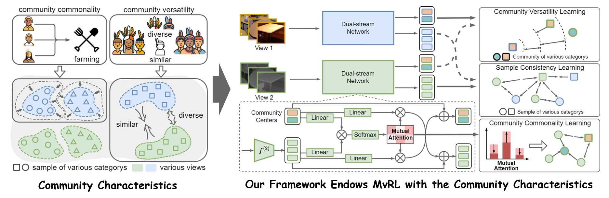

# Community-aware Multi-view Representation Learning with Incomplete Information

This repo contains the code and data of our IEEE TPAMI'2025 paper Community-aware Multi-view Representation Learning with Incomplete Information and the conference version IJCAI'2023 paper Incomplete Multi-view Clustering via Prototype-based Imputation.

> Haobin Li , Yunfan Li , Mouxing Yang , Peng Hu , Dezhong Peng and Xi Peng, Incomplete Multi-view Clustering via Prototype-based Imputation. 👉 [[paper]](https://www.ijcai.org/proceedings/2023/0435.pdf) [[GitHub]](https://github.com/XLearning-SCU/2023-IJCAI-ProImp) 

> Haobin Li, Yijie Lin, Peng Hu, Mouxing Yang, Xi Peng, Community-aware Multi-view Representation Learning with Incomplete Information. 👉 [[paper]](https://pengxi.me/wp-content/uploads/2025/11/Community-aware-Multi-view-Representation-Learning-with-Incomplete-Information.pdf) 

## Definition

**Community Commonality** refers to the identical custom shared within the same community.

**Community Versatility** refers to the similar but non-identical custom within communities of the same minority.

In the MvRL field, “minority” refers to the specific category, while “community” refers to the specific category within a particular view.

## Introduction

The introduction and employment of the two sociological concepts show a feasible way and novel insights toward achieving the robustness against incomplete information for MvRL.

Accordingly, **we endow MvRL with the two sociological concepts** by employing a novel dual-stream network with an elaborate objective function.

To restore the incomplete information, we propose a novel data imputation and alignment method **under a unified attention-based framework**.



## Requirements

pytorch==2.1.0 

numpy>=1.19.1

scikit-learn>=0.23.2

munkres>=1.1.4

## Configuration

The hyper-parameters, the training options are defined in configure.py.

## Datasets

The Scene-15, LandUse-21, and CUB datasets are placed in "data" folder. The other dataset could be downloaded from [cloud](https://pan.baidu.com/s/1kNjv_R9fZIANlg95IZMwpg?pwd=abcd).

## Usage

The code includes:

- an example implementation of the model. The network structure and training/evaluation pipeline are in 
```model_clustering.py``` , ```model_classify.py: ```  and ```model_HAR.py: ```

- clustering tasks for different sample-missing/view-unaligned rates/incomplete rates.
```bash
python run_clustering.py --dataset 0 --devices 0 --print_num 50 --test_time 5 --complete_prop 0.5
python run_clustering.py --dataset 0 --devices 0 --print_num 50 --test_time 5 --aligned_prop 0.5
python run_clustering.py --dataset 0 --devices 0 --print_num 50 --test_time 5 --complete_prop 0.5 --aligned_prop 0.5
```
- classification tasks for different missing rates.
```bash
python run_classify.py --dataset 0 --devices 0 --print_num 50 --test_time 5 --complete_prop 0.5
python run_classify.py --dataset 0 --devices 0 --print_num 50 --test_time 5 --aligned_prop 0.5
```
- human action recognition tasks
```bash
python run_HAR.py --dataset 0 --devices 0 --print_num 50 --test_time 5
```

You can get the following output:

```bash
Epoch : 50/150 ===> Learning Rate = 0.0010 ===> Rec = 2.1137e+00 ===> Com 
= 7.2145e-01 ===> Con = 6.7567e+01 ===> Ver = 6.0360e+00 ===> Total = 9.5461e+01                               
{'kmeans': {'AMI': 0.4374, 'NMI': 0.442, 'ARI': 0.2679, 'accur
acy': 0.4562, 'precision': 0.4506, 'recall': 0.4554, 'f_measure': 0.4441}}                                     
Epoch : 100/150 ===> Learning Rate = 0.0010 ===> Rec = 1.9168e+00 ===> Com
 = 5.8449e-01 ===> Con = 6.6475e+01 ===> Ver = 7.8117e-03 ===> Total = 8.6235e+01                              
{'kmeans': {'AMI': 0.4463, 'NMI': 0.4508, 'ARI': 0.2747, 'accu
racy': 0.4601, 'precision': 0.4511, 'recall': 0.4637, 'f_measure': 0.4521}}                                    
Epoch : 150/150 ===> Learning Rate = 0.0010 ===> Rec = 1.6719e+00 ===> Com
 = 4.9620e-01 ===> Con = 6.5914e+01 ===> Ver = 6.5449e-03 ===> Total = 8.3136e+01                              
{'kmeans': {'AMI': 0.4472, 'NMI': 0.4517, 'ARI': 0.2783, 'accu
racy': 0.4615, 'precision': 0.4551, 'recall': 0.466, 'f_measure': 0.447}}
```

## Citation

If you find our work useful in your research, please consider citing:

```latex
@article{li2025CAMERA,
	title={Community-aware Multi-view Representation Learning with Incomplete Information},
  	author={Haobin Li, Yijie Lin, Peng Hu, Mouxing Yang, Xi Peng},  
	journal={IEEE Transactions on Pattern Analysis and Machine Intelligence},     
 	year={2025},  
}
```

